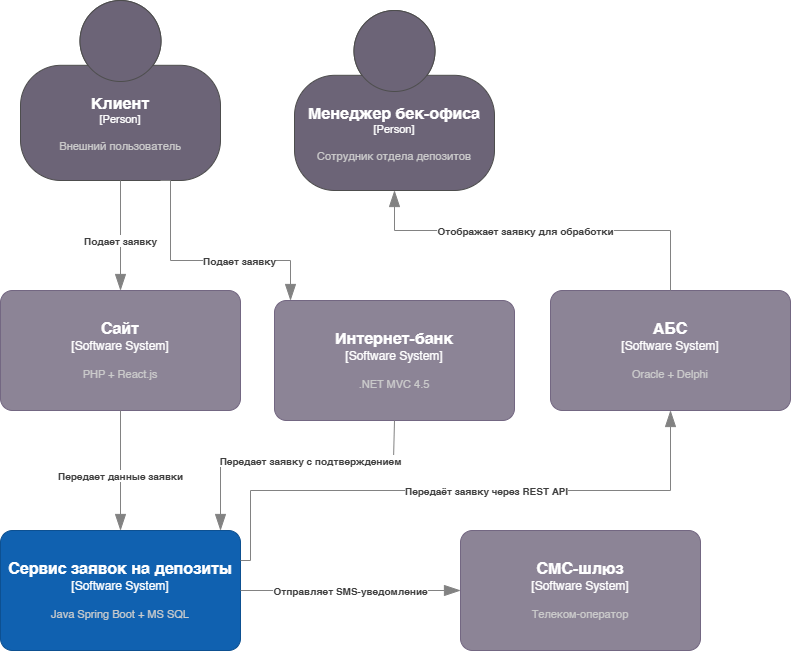
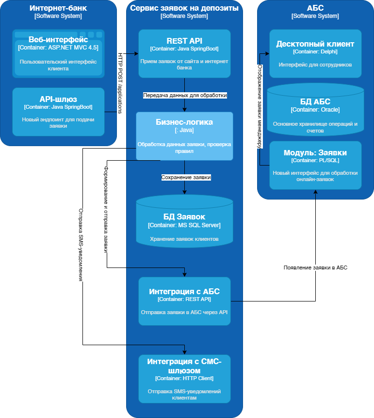

### <a name="_b7urdng99y53">Открытие депозитов онлайн — MVP</a> 
### <a name="_hjk0fkfyohdk">Светлана Морозкина</a>
### <a name="_uanumrh8zrui">13 ноября 2025</a>
### **Функциональные требования**

| **№** |**Действующие лица или системы**| **Use Case**                                 |**Описание**|
|:-----:| :- |:---------------------------------------------| :- |
|   1   |Клиент, Сайт, Система кол-центра| Подача заявки на депозит через сайт          |Клиент заходит на сайт, видит список депозитов, оставляет ФИО и телефон. Сайт передаёт данные в систему кол-центра. Оператор свяжется с клиентом.|
|   2   |Клиент, Интернет-банк, СМС-шлюз| Подача заявки на депозит через интернет-банк |Клиент в интернет-банке выбирает депозит, указывает сумму и счёт. После подтверждения СМС-кодом заявка отправляется в АБС для обработки менеджером бэк-офиса.|
|   3   |Менеджер бэк-офиса, АБС| Обработка заявки на открытие депозита        |Менеджер депозитов получает заявку из интернет-банка в АБС, проверяет клиента, утверждает ставку, создаёт депозит. Клиент получает СМС-уведомление.|
### **Нефункциональные требования**

| **№** | **Требование**                                                                                 |
|:-----:|:-----------------------------------------------------------------------------------------------|
|   1   | Система должна быть доступна 99.9% времени (24/7)                                              |
|2| Время отклика при загрузке списка депозитов — менее 1 секунды                                  |
|3| Все данные передаются по HTTPS (TLS 1.2+)                                                      |
|4| Персональные данные клиентов шифруются при хранении                                            |
|5| Интеграция с АБС не должна происходить напрямую через базу данных — только через API           |
|6| Архитектура должна позволять горизонтальное масштабирование интернет-банка                     |
|7| Решение должно использовать технологии, в которых есть экспертиза в банке (.NET, MS SQL, Oracle)|
|8| Все изменения должны быть задокументированы для дальнейшего расширения                         |
|9| Интерфейс должен соответствовать корпоративному стилю банка (цвета, логотипы)                  |
|10| Система должна выдерживать нагрузку до 500 заявок в день на этапе MVP                          |
### **Решение**
На основе анализа требований и IT-ландшафта предложено следующее решение:

1. Создаётся новый сервис — **Сервис заявок на депозиты**, который будет принимать заявки от сайта и интернет-банка, хранить их и интегрироваться с АБС через REST API. Это позволяет избежать прямого доступа к базе данных АБС, что критично для безопасности и стабильности.

2. Сервис реализуется на **Java Spring Boot** (с учётом наличия экспертизы у команды АБС) и использует **MS SQL** для хранения заявок — это соответствует требованиям поддерживаемости и совместимости.

3. В **интернет-банке** (.NET Framework 4.5) добавляется новый endpoint через API-шлюз, который отправляет данные в новый сервис. Ядро системы не меняется — изменения вносятся силами внутренней команды банка.

4. В **АБС** (Delphi + Oracle) добавляется новый модуль "Заявки на депозиты", доступный через десктопный интерфейс. Менеджеры бэк-офиса будут видеть входящие заявки и обрабатывать их, как и раньше, но теперь данные поступают автоматически.

5. Все передачи данных защищены: HTTPS, шифрование PII-данных, аутентификация по JWT.

6. Для масштабируемости интернет-банк и новый сервис могут работать в нескольких экземплярах за балансировщиком нагрузки. При сбое — переключение на резервный ЦОД.

7. Система выдерживает нагрузку до 500 заявок в день (MVP). При росте — возможно горизонтальное масштабирование.

### Логика принятия решений и выбора технологий

При проектировании руководствовались следующими принципами:

- **Использование имеющейся экспертизы**: команда АБС имеет опыт в Java, поэтому новый сервис реализуется на Java Spring Boot, а не на .NET.
- **Защита от перегрузки АБС**: данные заявок хранятся в отдельной MS SQL БД, а не в Oracle, чтобы не увеличивать нагрузку на АБС.
- **Минимизация изменений в зависимых системах**: ядро интернет-банка не меняется, изменения вносятся только через API-шлюз.
- **Соблюдение нефункциональных требований**: 99.9% доступность, шифрование, масштабируемость.
- **Поддержка будущего развития**: архитектура позволяет легко добавить автоматизацию ставок и другие продукты (например, кредиты).

Диаграммы контекста и контейнеров (приложены отдельно) отражают все ключевые компоненты и связи между ними.
### Диаграмма контекста

### Диаграмма контейнеров

Альтернативы
Опишите здесь наиболее важные альтернативные решения.
| Альтернатива | Почему не выбрана |
|--------------|-------------------|
| Прямое подключение интернет-банка к базе данных АБС | Высокий риск повреждения данных, нарушает безопасность, не масштабируется |
| Полный перевод интернет-банка на микросервисы | Слишком дорого и долго для MVP, выходит за рамки бюджета и сроков |
| Хранение заявок в Oracle (в АБС) | Увеличит нагрузку на и без того перегруженную базу — неприемлемо |
| Отказ от АБС и создание новой системы депозитов | Слишком высокая стоимость и срок реализации — не в рамках MVP |
| Использование Kafka для интеграции | Избыточно для текущей нагрузки (до 500 заявок/день), нет опыта у команды — можно добавить позже |

Недостатки, ограничения, риски
Подробно опишите здесь недостатки, ограничения и риски выбранного решения.
1. **Необходимость доработки АБС**  
   Команда АБС должна добавить новый модуль "Заявки на депозиты". Это может занять время и потребовать координации.

2. **Новые компоненты увеличивают сложность**  
   Появился новый сервис — его нужно поддерживать, мониторить, обновлять, обеспечивать логированием и аудитом.

3. **Зависимость от команды IT и подрядчика**  
   Реализация зависит от внутренней команды банка (Java) и подрядчика (интернет-банк). Задержки в одной команде повлияют на весь проект.

4. **Пока нет автоматизации ставок**  
   В MVP ставки всё ещё рассчитываются вручную на основе Excel. Полная автоматизация — на следующем этапе.

5. **Возможны задержки в обработке заявок**  
   Менеджеры бэк-офиса могут не успевать обрабатывать заявки — потребуется анализ нагрузки после запуска.

6. **Клиенты старшего возраста могут не понять процесс**  
   Нужна чёткая коммуникация: "заявка принята, звонок будет в течение 1–2 дней", иначе клиенты будут беспокоиться.
