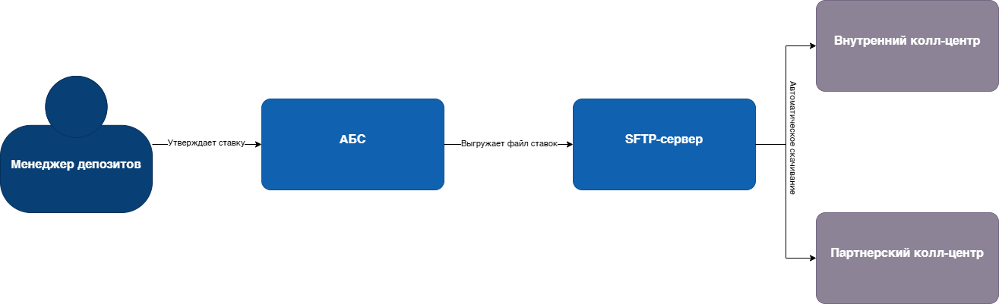
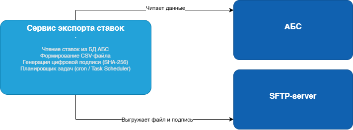
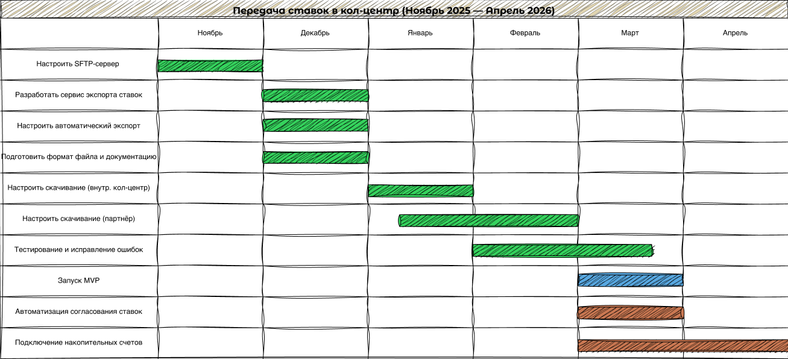

### <a name="_b7urdng99y53">Передача актуальных ставок по депозитам в кол-центр — MVP</a>
### <a name="_hjk0fkfyohdk">Светлана Морозкина</a>
### <a name="_uanumrh8zrui">13 ноября 2025</a>
### **Функциональные требования**

Функциональные требования
Опишите здесь верхнеуровневые Use Cases. Их нужно оформить в виде таблицы с пошаговым описанием:
|№|Действующие лица или системы|Use Case|Описание|
| :-: | :- | :- | :- |
| 1 | Менеджер депозитов, АБС | Утверждение ставки | Менеджер в АБС утверждает новую ставку по депозиту. Система фиксирует её как актуальную. |
| 2 | АБС, SFTP-сервер | Экспорт файла ставок | Раз в 2 часа система формирует файл `deposit_rates_latest.csv` и выкладывает его на SFTP-сервер. |
| 3 | Внутренний кол-центр | Получение файла ставок | Система кол-центра автоматически скачивает файл с SFTP и использует его для консультаций клиентов. |
| 4 | Партнёрский кол-центр | Получение файла ставок | Партнёрский кол-центр скачивает файл по SFTP и обновляет скрипты звонков. |

Нефункциональные требования
Опишите здесь нефункциональные требования и архитектурно значимые требования.
|№|Требование|
| :-: | :- |
| 1 | Файл должен обновляться не реже чем раз в 2 часа |
| 2 | Формат файла — CSV или Excel (.xlsx), с чёткой структурой |
| 3 | Файл должен содержать: продукт, ставка, срок, минимальная сумма, специальные условия |
| 4 | Файл должен быть подписан цифровой подписью (SHA-256) |
| 5 | Доступ к файлу — только по защищённому SFTP-каналу |
| 6 | Процесс должен быть полностью автоматизирован — без ручного участия |
| 7 | Система должна выдерживать нагрузку при массовых звонках клиентов |
| 8 | Решение должно использовать существующие технологии (Java, MS SQL, Oracle) |

Решение
Для обеспечения операторов кол-центров актуальными ставками предлагается реализовать **автоматизированный экспорт данных из АБС в виде файла**, доступного по SFTP.

1. В АБС добавляется **сервис экспорта ставок**, который:
    - Читает актуальные ставки из модуля "Заявки на депозиты"
    - Формирует файл `deposit_rates_latest.csv`
    - Генерирует цифровую подпись `deposit_rates_latest.csv.sig`
    - Выгружает файл на внутренний SFTP-сервер

2. Экспорт запускается **каждые 2 часа** через планировщик задач.

3. **Внутренний кол-центр** настраивает автоматическое скачивание файла с SFTP-сервера и интегрирует его в CRM.

4. **Партнёрский кол-центр** получает доступ к внешнему SFTP-каналу и настраивает свой скрипт для ежедневного скачивания файла.

### Диаграмма контекста

### Диаграмма компонентов

### Логика принятия решений и выбора технологий

- **SFTP + файлы** — единственный допустимый способ интеграции с партнёром (API запрещены).
- **CSV** — универсальный формат, поддерживается всеми системами, легко читается людьми.
- **Цифровая подпись (SHA-256)** — обеспечивает целостность данных, предотвращает подмену.
- **Планировщик задач** — простое и надёжное решение, не требует новых технологий.
- **Java/Oracle** — используются в АБС, есть экспертиза у команды.
- **Автоматизация** — исключает ручные ошибки и задержки.

Альтернативы

| Альтернатива | Почему не выбрана |
|--------------|-------------------|
| Передача ставок через API | Запрещено партнёрским кол-центром — нет возможности принимать HTTP-запросы |
| Ручная отправка Excel по email | Небезопасно, нет аудита, высокий риск ошибок — не соответствует целям цифровизации |
| Хранение ставок в интернет-банке и сайт | Кол-центр не имеет доступа к этим системам — не решает проблему |
| Использование Kafka или очередей | Избыточно — требуется только файловая выгрузка, нет нужды в потоковой передаче |

Недостатки, ограничения, риски
1. **Задержка до 2 часов** — если ставка изменена, кол-центр узнает об этом только после следующего экспорта.
2. **Зависимость от SFTP-инфраструктуры** — если сервер упадёт, кол-центр останется без данных.
3. **Партнёр может не настроить скачивание** — требует координации и обучения внешней команды.
4. **Нет обратной связи** — банк не знает, получил ли партнёр файл.
5. **Риск повреждения файла** — если не проверять подпись, операторы могут работать с неверными данными.
6. **Ограниченная гибкость** — нельзя передавать сложную логику (например, персонализированные ставки).

### RoadMap: Передача ставок в кол-центр

